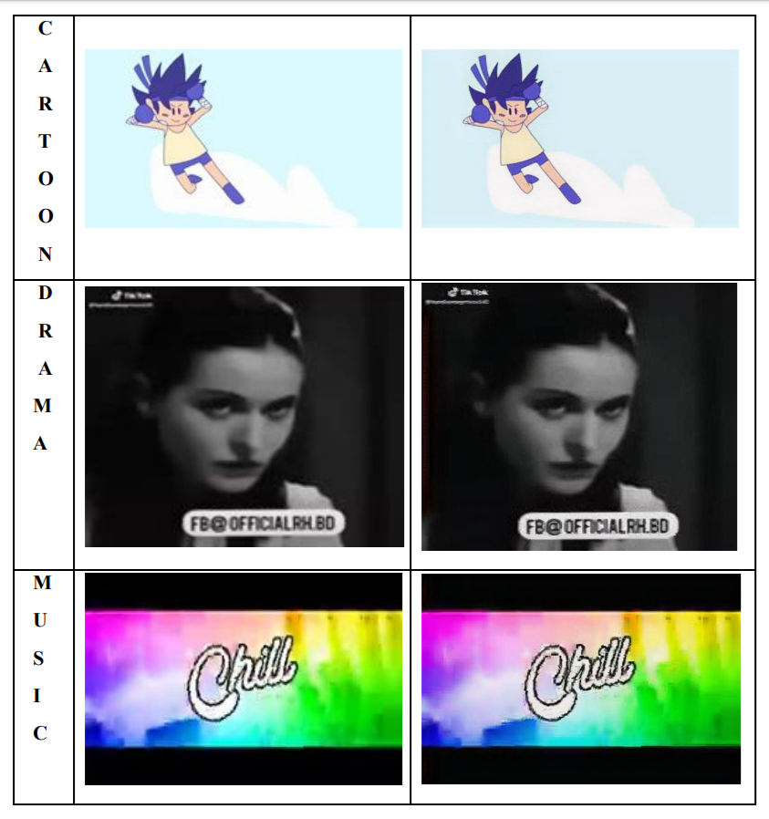

# SRGAN Based Video-Enhancement-using-Single-Image-Super-Resolution

In this project,we have used a pretrained Super-Resolution Generative Adversarial Networks(SRGAN) Model. We provide a low resolution video as input and get Super Resolved Video as output. The Steps for running the Model in Google Colaboratory are as follows-

## STEP-1
Clone the following repository in your Notebook, which consists of Pretrained SRGAN Model-

``` !git clone https://github.com/krasserm/super-resolution ```

## STEP-2
Create a directory for Super Resolution by using the command-

```cd /content/super-resolution```

## STEP-3
We Require Pretrained weight for running the model SRGAN, download the weight for SRGAN from below-

[weights-srgan.tar.gz](https://drive.google.com/file/d/1ZKpQvtxLKKq2fM1gKtl085pgHSgSQSBw/view?usp=sharing)

After downloading the weight, upload it in your notebook and then run the command below for extracting the weight in the root folder-
```!tar xvfz /content/weights-srgan.tar.gz```


## STEP-4
Just run the following code for the SRGAN Model implementation in your video-

```python
# Importing all necessary libraries 
import timeit
import cv2 
import os
import numpy as np
from model import resolve_single
from utils import load_image, plot_sample
from model.srgan import generator

# Read the video from specified path 
cam = cv2.VideoCapture("/content/Drama144p_input.3gp") 
fps = cam.get(cv2.CAP_PROP_FPS)
print(fps)


try:
      
    # creating a folder named data 
    if not os.path.exists('data'): 
        os.makedirs('data') 
  
# if not created then raise error 
except OSError:
    print ('Error: Creating directory of data') 
  
#frames Extraction from video 
currentframe = 0
arr_img = []
while(True): 
      
    # reading from frame 
    ret,frame = cam.read() 
  
    if ret: 
        # if video is still left continue creating images 
        name = './data/frame' + str(currentframe).zfill(3) + '.jpg'
        print ('Creating...' + name) 
  
        # writing the extracted images 
        cv2.imwrite(name, frame) 
  
        # increasing counter so that it will show how many frames are created 
        currentframe += 1
        #storing the path of extracted frames in a list
        arr_img.append(name)
    else: 
        break
#print(arr_img)

start = timeit.default_timer()
model = generator()
model.load_weights('weights/srgan/gan_generator.h5')

#Initialization of an empty list to store the super resolved images
arr_output=[]
print(len(arr_img))
n= len(arr_img)

#Implementation of SRGAN Model in extracted frames
for i in range(n):
  lr = load_image(arr_img[i])
  sr = resolve_single(model, lr)
  #plot_sample(lr, sr)
  
  arr_output.append(sr)
stop = timeit.default_timer()
#print(arr_output)

print("time : ", stop-start)

# Release all space and windows once done 
cam.release() 
cv2.destroyAllWindows()
```

Here we are attatching a picrure of model implementation on the frame-



# STEP-5
Run the Code below for saving the super resolved frames in a folder and storing their output path in a list-

```python
#Importing necessary libraries
from keras.preprocessing.image import load_img
from keras.preprocessing.image import img_to_array
from keras.preprocessing.image import array_to_img
from keras.preprocessing.image import save_img

#Making a directory for storing super resolved frames in image format
os.makedirs("output_images")

#Initialization of an empty list to store the path of Super resolved frames
s_res= []
for j in range(len(arr_output)):
  out_name = '/content/super-resolution/output_images/frame' + str(j).zfill(3) + '.jpg'
  img_pil = array_to_img(arr_output[j])
  img1 = save_img(out_name, img_pil)
  s_res.append(out_name)
  
#print(s_res)
```

# STEP-6
Run the code below for conversion of super resolved frames into a Video-

```python
import cv2
import numpy as np
for i in range(len(s_res)):
    filename=s_res[i]
    #reading each files
    img = cv2.imread(filename)
    height, width, layers = img.shape
    size = (width,height)

fps = 20       #Put the fps value as your convenience or 
               #Calculate by using (No. of frames)/Video_duration in seconds  

#Creation of output video               
out = cv2.VideoWriter('drama2_output.mp4',cv2.VideoWriter_fourcc(*'DIVX'), fps , size)

#Writing Frames into video
for i in range(len(s_res)):
    out.write(cv2.imread(s_res[i]))
out.release()
```

# Final Results - 
Go through the link given below for the results of the project, when it is implemented in a video-

[Video Results](https://drive.google.com/drive/folders/1NiyJCLsB_-pAmFJNF97QhZiho7zPLMCw?usp=sharing)


